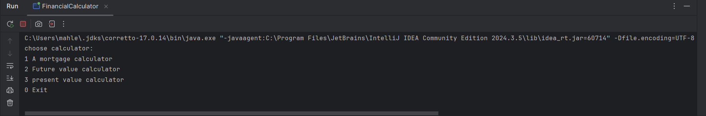
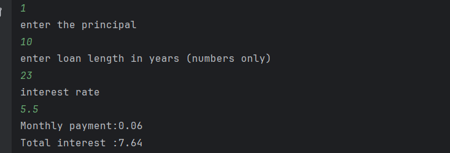
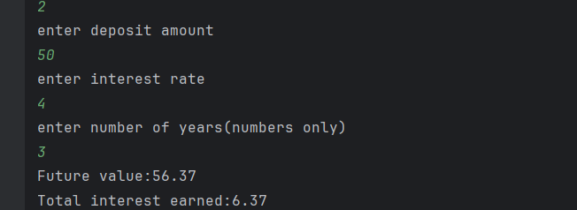
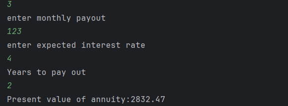

# Financial calculator
These projects provide three financial tools in one program:

_Mortgage Calculator 

_Future Value Calculator

_present Value of Annuity Calculator
## Screenshots 
### Home Screen

### Mortgage Calculator-Correct OutPut

### Future Value - Error Example

### present value calculator

### Interesting Code 
One interesting piece of code is the 'try-catch' block used to catch invalid input. It prevents the program from crashing and helps the user re-enter valid numbers. 
